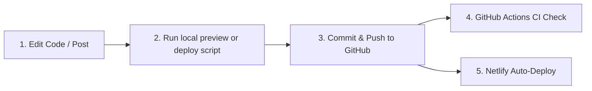

# Voice of Hibernation Blog

A Jekyll blog deployed automatically to Netlify via GitHub CI/CD integration.

---

## 🛠️ Application Development & Deployment Workflow



### 1️⃣ Make Edits
Edit markdown files, posts in `_posts/`, layout files in `_layouts/`, or styles in `_sass/` / `assets/`.

---

### 2️⃣ Option A: 1-Step Automated Push & Deploy Script (Recommended)
Run the included PowerShell script to stage, commit, push to GitHub, and trigger Netlify deploy all in one go:

```powershell
.\deploy.ps1 "feat: add new blog post"
```

---

### 3️⃣ Option B: Manual Git Workflow

```powershell
# 1. Check changed files
git status

# 2. Stage changes
git add .

# 3. Commit changes
git commit -m "your commit message"

# 4. Push to GitHub (Triggers Netlify Build automatically)
git push origin main
```

---

## ⚙️ Build Configuration (`netlify.toml`)

- **Base Directory**: `.` (Root)
- **Publish Directory**: `_site`
- **Build Command**: `bundle exec jekyll build`
- **Ruby Version**: `3.2.2`
- **Jekyll Version**: `4.4.1`
